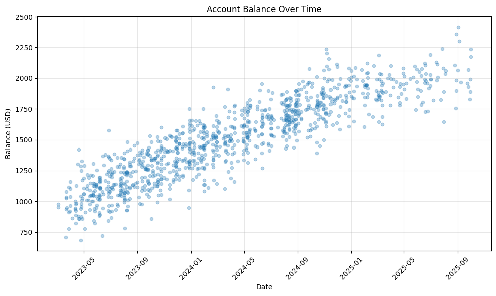

# UBS Transactions CSV Parser

A Python package to parse and process transaction CSV files exported from UBS online banking.

## Usage

Install the package with your preferred method.

```bash
pip install ubs-transactions-csv-parser
```

Import the transactions from a CSV file.

```python
from ubs_transactions_csv_parser import CsvExportData
from pathlib import Path

# Parse a CSV file
csv_data = CsvExportData.from_path(Path("transactions.csv"))

# Access the transactions
for transaction in csv_data.transactions:
    # ...
```

## UBS CSV Format

UBS exports transactions in a non-standard CSV format with two sections:

1. **Metadata section** - Account information and period details
2. **Transactions section** - Standard CSV with transaction data

Example format:
```
Account number:;1234 12345678.12;
IBAN:;CH20 0011 2233 4455 6677 B;
From:;2025-01-01;
Until:;2025-12-31;
Opening balance:;1234.12;
Closing balance:;12345.12;
Valued in:;CHF;
Numbers of transactions in this period:;365;

Trade date;Trade time;Booking date;Value date;Currency;Debit;Credit;Individual amount;Balance;Transaction no.;Description1;Description2;Description3;Footnotes;
2025-01-01;00:11:22;2025-01-01;2025-01-01;CHF;-137.00;;;1370.17;4825794DP1572581029;"John Doe";"Standing order";"Reference details";;
```

## Example jupyter notebook

Check out the [example Jupyter notebook](examples/ubs-transactions-csv-parser.ipynb) for data analysis and visualization examples. Below an example plot of transactions imported from multiple files.



## License

This project is licensed under the MIT License. See the LICENSE file for details.
